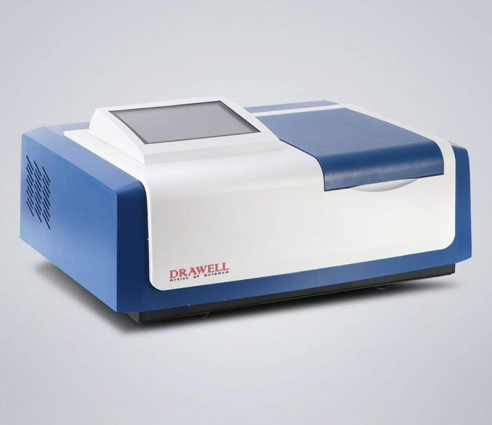
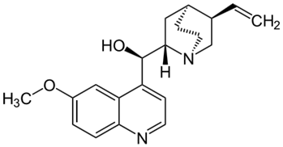
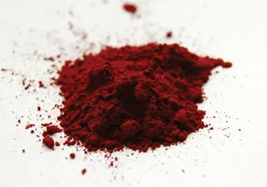
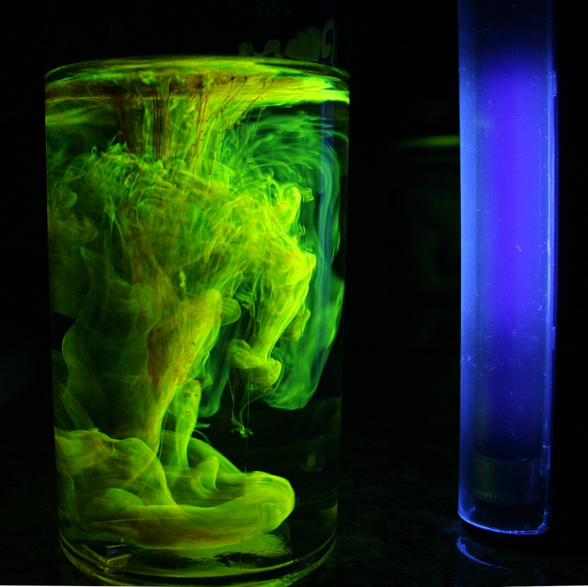
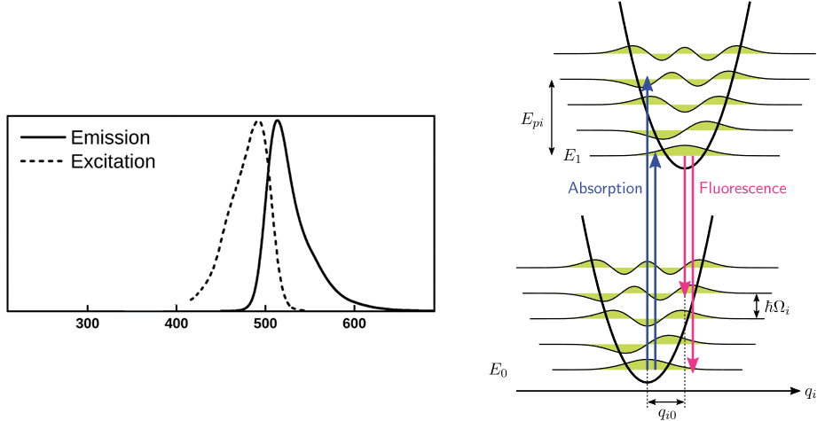

# Practicum: Molecuulspectrometrie

## UV/Vis & fluorescentie

## Leerdoelen

Na afloop van dit practicum:

- kun je metingen uitvoeren met moderne spectrometrische technieken;
- kun je meetdata inlezen en verwerken met Python;
- kun je materialen karakteriseren met behulp van spectrometrie.

!!! veiligheid "Veiligheid"

    1. Draag altijd een **labjas en veiligheidsbril** wanneer je met chemische oplossingen werkt.
    2. Twijfel je over een handeling of het gebruik van een apparaat? Vraag dit altijd aan de practicumbegeleider.


# Introductie

In dit practicum maak je kennis met twee belangrijke spectrometrische technieken die veel worden toegepast binnen de technische natuurkunde:

1. **UV/Vis-absorptiespectrometrie**
2. **Fluorescentiespectroscopie**

Met deze technieken kunnen optische eigenschappen van materialen worden onderzocht, zoals absorptie en emissie. Ze worden onder andere toegepast in optische sensoren, materiaalkarakterisatie en onderzoek naar licht- en energieconversie.

Je werkt in drietallen aan twee experimenten:

- **Proef A — UV/Vis-absorptie van kinine in tonic**
- **Proef B — Fluorescentie van fluoresceïne bij verschillende pH**

Beide experimenten hebben een **aparte voorbereiding**.



*Figuur: Een moderne spectrometer.*


# Proef A — UV/Vis-absorptie van kinine in tonic

## Theorie

UV/Vis-spectroscopie meet de absorptie van licht in het ultraviolette en zichtbare deel van het elektromagnetische spectrum.

Moleculen met geconjugeerde $\pi$-systemen, zoals kinine, kunnen licht bij specifieke golflengten absorberen.

De wet van Lambert-Beer geeft het verband tussen de absorbantie $A$, de concentratie $c$, de molaire extinctiecoëfficiënt $\varepsilon$ en de optische weglengte $l$:

$$
A = \varepsilon c l.
$$

Hieruit volgt dat de absorbantie bij een vaste golflengte en cuvetlengte evenredig is met de concentratie.

Door oplossingen met bekende concentraties kinine te meten, kan daarom een **kalibratielijn** worden gemaakt. Met deze kalibratielijn kan vervolgens de onbekende concentratie kinine in tonic worden bepaald.

Kinine is verantwoordelijk voor de bittere smaak van tonic. Het molecuul absorbeert voornamelijk in het UV-gebied. Daarom gebruiken we een UV/Vis-spectrometer die ook bij ultraviolette golflengten kan meten.

Kinine is bovendien fluorescent. Na excitatie met UV-licht kan het zichtbaar blauw licht uitzenden.



*Figuur: Structuurformule van kinine.*


!!! voorbereiding "Voorbereiding Proef A"

    1. Bekijk de kennisclips over **UV/Vis en fluorescentie**.
    2. Zoek het absorptiespectrum van kinine op en voeg dit toe aan je digitale labjournaal.
    3. Waarom gebruiken we bij UV/Vis-metingen **kwartscuvetten** in plaats van glazen cuvetten?
    4. Zoek het spectrum van fluoresceïne op en noteer welke emissiekleur je verwacht.
    5. Bereid in Python een script voor waarmee je een **kalibratielijn** kunt fitten.


!!! methode "Methode Proef A"

    **Beschikbare materialen:**

    - UV/Vis-spectrometer (Varian of Vernier);
    - kinineoplossingen van 0, 2, 4, 6 en 8 mg/L;
    - tonic;
    - 0,05 M H₂SO₄;
    - kwartscuvetten;
    - UV-zaklamp.

    **Werkwijze:**

    1. Verdun de tonic **10×** door 1 mL tonic te mengen met 9 mL 0,05 M H₂SO₄.
    2. Neem een spectrum op van de hoogste kinineconcentratie en van de verdunde tonic.
    3. Bepaal op basis van de spectra een geschikte golflengte voor de kwantitatieve analyse.
    4. Meet de volledige kalibratiereeks en het tonicmonster bij deze golflengte.
    5. Observeer de fluorescentie van kinine met de UV-zaklamp.


!!! opdracht "Uitvoering Proef A"

    1. Noteer je observaties in je digitale labjournaal.
    2. Neem spectra op van de kalibratiereeks en de verdunde tonic.
    3. Kies een geschikte analysegolflengte.
    4. Meet iedere oplossing indien mogelijk **drie keer**, zodat je ook de spreiding van de metingen kunt bepalen.
    5. Observeer de fluorescentie van kinine en noteer de waargenomen kleur en intensiteit.


!!! opdracht "Verwerking Proef A"

    1. Verwerk alle meetdata in Python.
    2. Plot het absorptiespectrum van de hoogste kinineconcentratie en het spectrum van de verdunde tonic in één figuur.
    3. Maak bij de gekozen analysegolflengte een grafiek van de absorbantie tegen de kinineconcentratie.
    4. Fit een rechte lijn door de meetpunten en bepaal de parameters van de kalibratielijn.
    5. Bepaal met behulp van de kalibratielijn de kinineconcentratie van het verdunde tonicmonster.
    6. Corrigeer voor de verdunningsfactor en bepaal daarmee de kinineconcentratie in de oorspronkelijke tonic.
    7. Neem de spreiding van de herhaalde metingen mee in je analyse.
    8. Bespreek of de gemeten spectra en fluorescentie overeenkomen met wat je op basis van de theorie verwacht.


!!! afronding "Afronding Proef A"

    1. Laat je resultaten controleren door de practicumbegeleider.
    2. Zet de gemaakte figuren in je digitale labjournaal en voorzie iedere figuur van een duidelijk onderschrift waarin je uitlegt wat er te zien is.
    3. Vul de **Resultaten en Discussie** in je labjournaal aan. Bespreek hierin in ieder geval:
    
       - de kalibratielijn;
       - de bepaalde kinineconcentratie;
       - de betrouwbaarheid van de meting;
       - de waargenomen fluorescentie.


# Proef B — Fluorescentie van fluoresceïne

Fluoresceïne is een sterk fluorescerend molecuul dat onder andere wordt gebruikt in de oogheelkunde en optometrie.

Het molecuul absorbeert sterk in het blauwe deel van het zichtbare spectrum. De waargenomen kleur en fluorescentie zijn afhankelijk van de pH van de oplossing. Dit komt doordat fluoresceïne bij verschillende pH-waarden in verschillende protonatietoestanden voorkomt, die verschillende optische eigenschappen hebben.





*Figuur: Fluoresceïne in poedervorm en in oplossing onder UV-belichting.*


## Theorie

Veel kleurstoffen bevatten een uitgebreid **geconjugeerd systeem** van afwisselende enkele en dubbele bindingen.

Naarmate het geconjugeerde systeem groter wordt, wordt het energieverschil tussen relevante elektronische toestanden doorgaans kleiner. Hierdoor verschuift de absorptie naar lagere fotonenergieën en dus naar grotere golflengten.

De elektronische grondtoestand en aangeslagen toestand van een molecuul bevatten daarnaast verschillende **vibrationele energieniveaus**. Bij absorptie kan een molecuul daardoor vanuit de elektronische grondtoestand naar verschillende vibrationele niveaus van een aangeslagen elektronische toestand worden gebracht.

Dit kan ervoor zorgen dat een absorptiespectrum uit meerdere banden of pieken bestaat.

Na excitatie kan het molecuul energie verliezen door vibrationele relaxatie. Vervolgens kan het door emissie van een foton terugkeren naar de elektronische grondtoestand. Hierdoor ligt de fluorescentie-emissie doorgaans bij een **langere golflengte** dan de absorptie.



*Figuur: Absorptie- en emissieprofielen en een schematische weergave van elektronische en vibrationele energieniveaus.*


!!! voorbereiding "Voorbereiding Proef B"

    1. Zoek het absorptiespectrum van fluoresceïne op en voeg dit toe aan je digitale labjournaal.
    2. Bepaal op basis hiervan een geschikte **excitatiewavelength** voor het opwekken van fluorescentie.
    3. Hoe kun je uit een spectrum een schatting maken van het energieverschil tussen vibrationele energieniveaus?
    4. Installeer **Vernier Spectral Analysis**.


!!! methode "Methode Proef B"

    Maak drie oplossingen:

    - **Oplossing 1:** 5 mL fluoresceïne + 5 mL demiwater;
    - **Oplossing 2:** 5 mL fluoresceïne + 5 mL pH 5-buffer;
    - **Oplossing 3:** 5 mL fluoresceïne + 5 mL pH 3-buffer.

    Vervolgens:

    1. Meet het absorptiespectrum van iedere oplossing.
    2. Meet het emissiespectrum bij een geschikte excitatiegolflengte.
    3. Kies geschikte instellingen voor:
    
       - integration time;
       - smoothing;
       - aantal middelingen (*averages*).
    
    4. Exporteer de meetdata voor verdere verwerking in Python.


!!! opdracht "Uitvoering Proef B"

    1. Noteer je observaties in je digitale labjournaal.
    2. Meet de absorptie- en emissiespectra van alle monsters.
    3. Vergelijk tijdens het meten al kwalitatief de spectra bij de verschillende pH-waarden.


## Data inlezen met Python

De spectrometerdata worden geëxporteerd naar een tekstbestand. Voordat je dit bestand met Python inleest, moet je eerst bekijken hoe het bestand is opgebouwd.

!!! opdracht "Verwerking Proef B — Data inlezen"

    1. Open het databestand eerst in een teksteditor.
    2. Bepaal hoe het bestand is opgebouwd. Zoek onder andere uit:
    
       - welke regels tot de **header** behoren;
       - of er een **footer** aanwezig is;
       - welk teken als **decimaalteken** wordt gebruikt;
       - welk teken als **separator** tussen de kolommen wordt gebruikt.
    
    3. Gebruik deze informatie om het bestand met `pandas.read_csv()` in te lezen.
    4. Print vervolgens de kolomnamen met `df.keys()`.


```python title="Data importeren"
import pandas as pd

df = pd.read_csv(
    "filename",
    decimal="...",
    sep="...",
    header="...",
    skipfooter=...
)

print(df.keys())
```


!!! opdracht "Verwerking Proef B — Spectra"

    1. Plot het absorptie- en emissiespectrum in één figuur.
    
       Gebruik hiervoor:
       
       - één gezamenlijke x-as voor de golflengte in nm;
       - een y-as voor de absorbantie;
       - een tweede y-as voor de fluorescentie-intensiteit.

    2. Vergelijk de spectra bij de verschillende pH-waarden. Kijk onder andere naar:
    
       - veranderingen in piekpositie;
       - veranderingen in absorptie;
       - veranderingen in fluorescentie-intensiteit.

    3. Bepaal waar mogelijk het energieverschil tussen relevante vibrationele niveaus en bespreek hoe dit zichtbaar is in het spectrum.


!!! afronding "Afronding Proef B"

    1. Laat je resultaten controleren door de practicumbegeleider.
    2. Zet de gemaakte figuren in je digitale labjournaal en voorzie iedere figuur van een duidelijk onderschrift.
    3. Vul de **Resultaten en Discussie** aan. Bespreek hierin in ieder geval:
    
       - de invloed van pH op absorptie;
       - de invloed van pH op fluorescentie;
       - de positie van de absorptie- en emissiebanden;
       - de koppeling met de elektronische en vibrationele energieniveaus.


# Appendix 1 — Voorbeeld dubbele y-as

Onderstaand voorbeeld laat zien hoe je met Matplotlib twee verschillende y-assen kunt gebruiken voor een absorptie- en emissiespectrum.

```python title="Absorptie en emissie met dubbele y-as"
import matplotlib.pyplot as plt

fig, ax1 = plt.subplots()
ax2 = ax1.twinx()

ax1.plot(lambda_abs, absorbance, label="Absorptie")
ax2.plot(lambda_em, fluorescence, label="Emissie")

ax1.set_xlabel("Golflengte (nm)")
ax1.set_ylabel("Absorbantie")
ax2.set_ylabel("Fluorescentie-intensiteit (a.u.)")

fig.tight_layout()
plt.show()
```